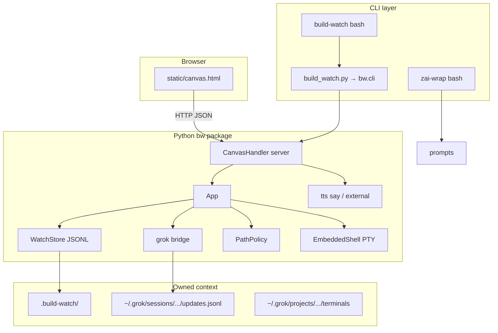

# EXPLAIN — zai-wrap + build-watch v2

## One sentence

**zai-wrap** ships structured prompts for Z.AI coding agents; **build-watch** is a localhost HTTP app that streams project context, Grok Build tool activity, terminals, and TTS into a single canvas UI.

## Architecture

## Module responsibilities

| Module | Responsibility |
|--------|----------------|
| `bw/app.py` | Wires store, grok lock, canvas_state, bootstrap_grok, grok_rebuild, save_file |
| `bw/server.py` | ThreadingHTTPServer route table, JSON I/O, 413/4xx semantics |
| `bw/grok.py` | Tail `updates.jsonl`, rebuild turns/activities, grok_status |
| `bw/storage.py` | settings.json, events.jsonl, dictation.jsonl (locked appends) |
| `bw/paths.py` | resolve_project/watch, PathPolicy sandbox |
| `bw/security.py` | sanitize IDs, JSON parse, TTS voice resolution |
| `bw/terminal.py` | EmbeddedShell PTY + pin/mirror helpers |
| `bw/terminals.py` | Discover Grok terminal `.txt` logs |
| `bw/previews.py` | Dev server port scan, artifact globs, git cache |
| `bw/tts.py` | `say` or external command backend |
| `bw/boot.py` | Preflight checks → version 2.0.0 |
| `static/canvas.html` | Lovable-style UI: Read, Grok Build, preview, stream |

## Concurrency model

- `ThreadingHTTPServer` — one thread per request.
- `App._grok_lock` — ingest, bootstrap, rebuild serialized.
- `EmbeddedShell._api_lock` — PTY start/stop/write serialized.
- `WatchStore._io_lock` — events/settings writes serialized.
- `fcntl` lock on grok `activity.jsonl` appends.

## Data ownership (12-factor)

All durable agent-visible state lives under **`.build-watch/`** in the project (or `BUILD_WATCH_DIR`), not in server memory:

| File | Content |
|------|---------|
| `events.jsonl` | Build stream (`kind`, `msg`, `files`) |
| `settings.json` | TTS prefs, UI toggles |
| `grok_session.json` | Linked session_id + updates path |
| `grok_offset.txt` | Byte offset into updates.jsonl |
| `turns.jsonl` | Parsed Grok turns for canvas |
| `activity.jsonl` | Tool-level grok activities |
| `terminal_pin.json` | Pinned terminal snapshot |
| `dictation.jsonl` | STT/dictation rows |
| `server.pid` | Background server PID |

## Integration points

- **Grok CLI:** `~/.grok/sessions/<encoded-path>/<session_id>/updates.jsonl`
- **Grok terminals:** `~/.grok/projects/<project>/terminals/*.txt`
- **Z.AI:** user pastes `zai-wrap compose` output into Cline/Claude Code
- **Related Grok skills:** `agent-chat`, `agent-team`, `/review`, `/implement`

## Recent engineering (2026-06-05)

- v2 rebuild: monolithic `build_watch.py` → `bw/` package + shims
- Review fixes: `import sys`, 413 body drain, `_grok_json` guards, grok/PTY locks
- `test_api.py` smoke harness (14 tests)
- Pluggable TTS via `BUILD_WATCH_TTS_*`
- Reference docs: `VOICE_CLONING.md`, `GITHUB_MORPH_LIST_B.md`